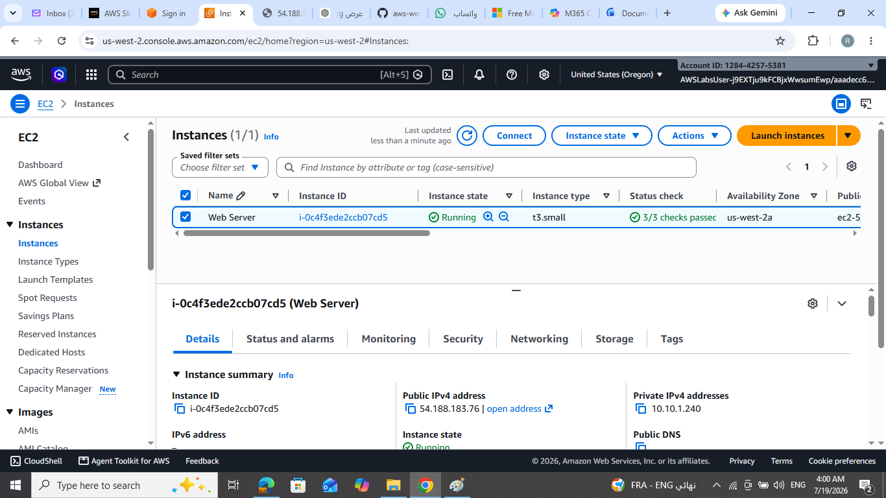
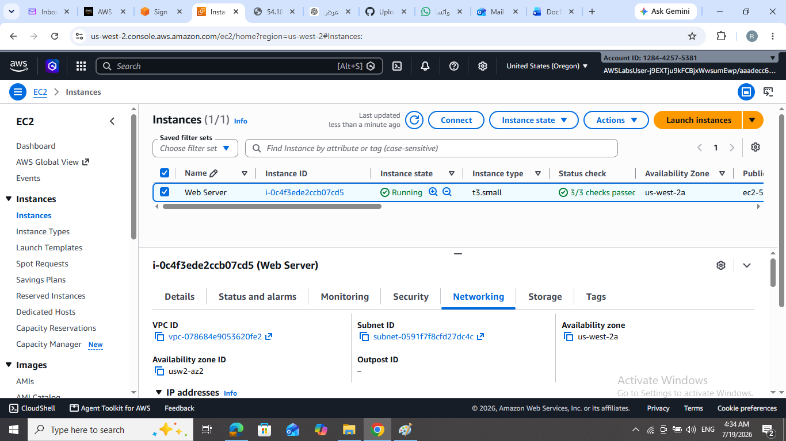
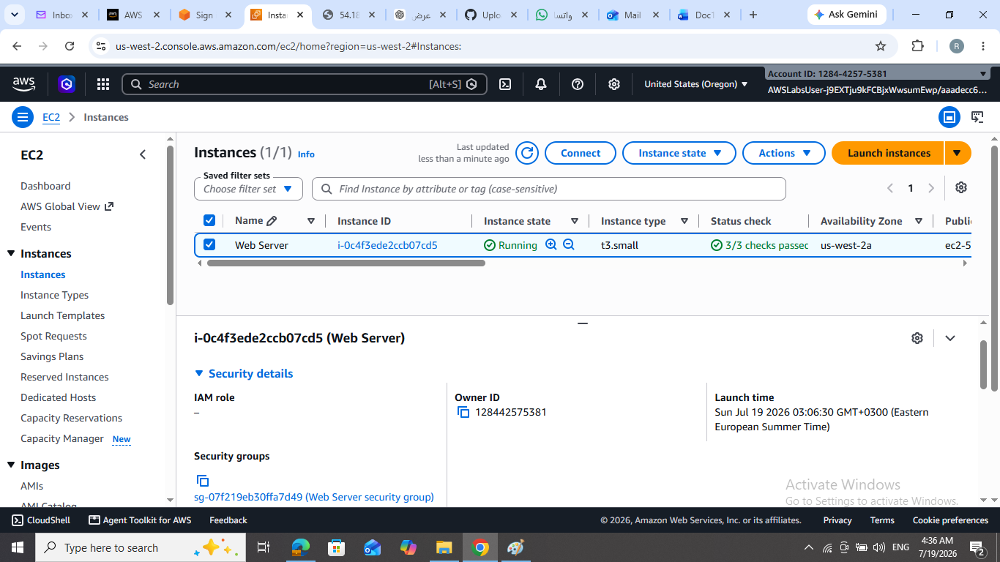
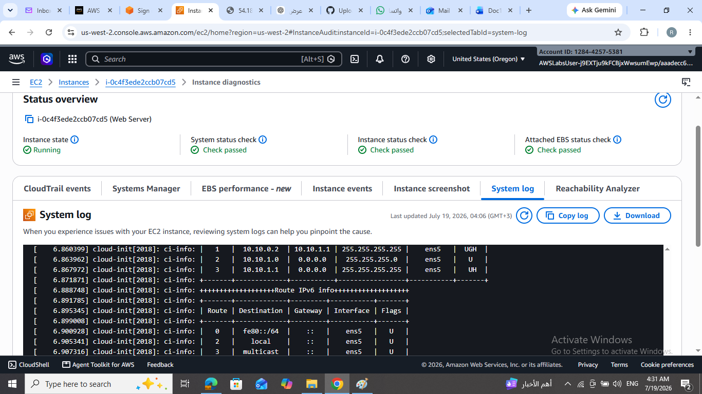
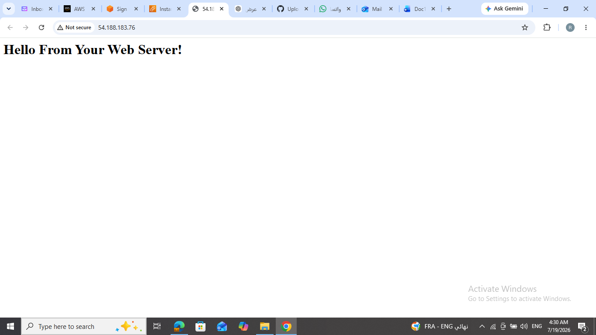

# AWS Web Server Lab

## Project Overview
This project demonstrates how to deploy a web server on an Amazon EC2 instance.

## Objective
Deploy a web server on an EC2 instance and access it through the Public IP.

## AWS Services Used
- Amazon EC2
- Amazon VPC
- Security Group
- Amazon EBS

## What I Learned
- Launch an EC2 instance.
- Configure a Security Group.
- Understand the role of a VPC.
- Attach an EBS volume.
- View the System Log.
- Access the web server using the Public IP.

## Lab Screenshots

### EC2 Running

### VPC

### Security Group

### System Log

### Web Server

### EBS Volume

