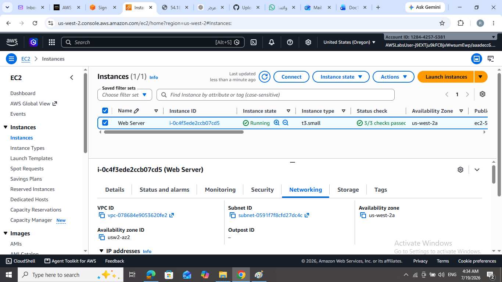
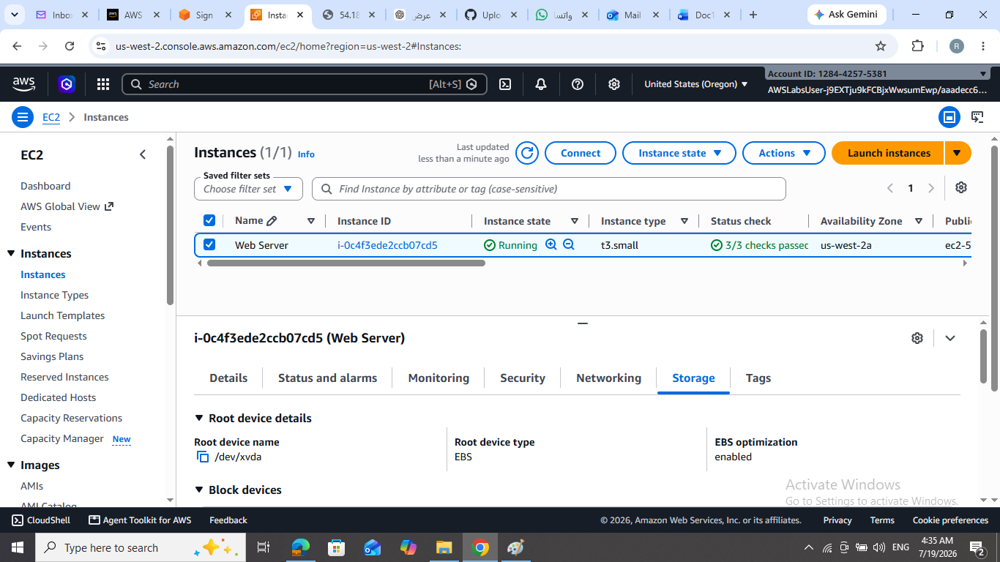

# AWS Web Server Lab

## 📌 Project Overview

This project demonstrates how to deploy a web server on an Amazon EC2 instance using AWS.

## 🎯 Objective

Deploy a web server and access it through the EC2 Public IP address.

## 🛠 AWS Services Used

* Amazon EC2
* Amazon VPC
* Security Group
* Amazon EBS

## 📚 What I Learned

* Launch an Amazon EC2 instance.
* Configure a Security Group.
* Understand the role of a VPC.
* View the EC2 System Log.
* Understand Amazon EBS.
* Access a web server using the Public IP address.

## 📸 Lab Screenshots

### 1. VPC

### 2. EC2 Running

### 3. EBS

### 4. Security Group

### 5. Web Server

### 6. System Log

## ✅ Result

The web server was successfully deployed on an Amazon EC2 instance and accessed through the EC2 Public IP address.
